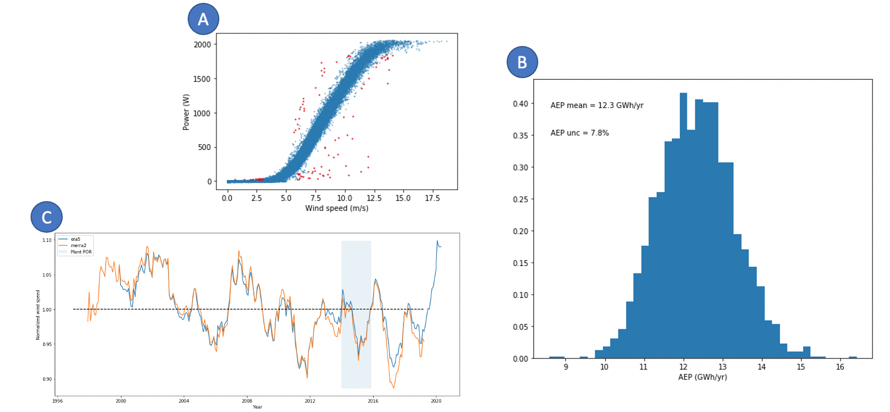

<!--
JOSS welcomes submissions from broadly diverse research areas. For this reason, we require that authors include in the paper some sentences that explain the software functionality and domain of use to a non-specialist reader. We also require that authors explain the research applications of the software. The paper should be between 250-1000 words.

Your paper should include:

A list of the authors of the software and their affiliations, using the correct format (see the example below).
A summary describing the high-level functionality and purpose of the software for a diverse, non-specialist audience.
A clear Statement of Need that illustrates the research purpose of the software.
A list of key references, including to other software addressing related needs.
Mention (if applicable) a representative set of past or ongoing research projects using the software and recent scholarly publications enabled by it.
Acknowledgement of any financial support.
As this short list shows, JOSS papers are only expected to contain a limited set of metadata (see example below), a Statement of Need, Summary, Acknowledgements, and References sections. You can look at an example accepted paper. Given this format, a “full length” paper is not permitted, and software documentation such as API (Application Programming Interface) functionality should not be in the paper and instead should be outlined in the software documentation.

Review Checklist:
Summary: Has a clear description of the high-level functionality and purpose of the software for a diverse, non-specialist audience been provided?
A statement of need: Do the authors clearly state what problems the software is designed to solve and who the target audience is?
State of the field: Do the authors describe how this software compares to other commonly-used packages?
Quality of writing: Is the paper well written (i.e., it does not require editing for structure, language, or writing quality)?
References: Is the list of references complete, and is everything cited appropriately that should be cited (e.g., papers, datasets, software)? Do references in the text use the proper citation syntax?

-->

# Summary

OpenOA is an open source framework for operational data analysis of wind energy plants, implemented in the Python programming language [@Rossum2009]. OpenOA provides a common data model, high level analysis workflows, and low-level convenience functions that engineers, analysts, and researchers in the wind energy industry can use to facilitate analytics workflows on operational data sets. OpenOA contains documentation, worked out examples in Jupyter notebooks, and a corresponding example dataset from the [Engie Renewable's La Haute Borne Dataset](https://opendata-renewables.engie.com/explore/dataset/d543716b-368d-4c53-8fb1-55addbe8d3ad/information).

Originally released to the public in 2018 [@osti_1478526], OpenOA is now actively developed through a public Github repository. With over 50 stars on Github, a dozen contributors, and an active issues forum, OpenOA is becoming a mature project that provides a high level interface to solve practical problems in the wind energy industry. OpenOA V2 is released as a Python package and is freely available under a business-friendly, open-source, BSD license. By committing to open source development, OpenOA hopes to facilitate reproducibility of research in this field, provide benchmark implementations of commonly performed data transformation and analysis tasks, and to serve as a conduit that delivers state-of-the-art analysis methods from researchers to practitioners.

Most users will interface with OpenOA through its analysis `methods` module. This includes Python classes which conform to a common interface (e.g., they implement `__init__`, `prepare`, and `run` methods). Version 2 of OpenOA implements three high level analysis methods for the calculation of: (1) Long term corrected annual energy production (AEP), (2) electrical losses, and (3) turbine level losses. Uncertainty quantification is achieved in each analysis using a Monte Carlo approach. A more detailed description of these analyses are provided [in the documentation](https://openoa.readthedocs.io). Low level functions that operate on Pandas series objects are organized in the `toolkit` module. These Python functions are written to be as generic as possible, and can be applied across multiple domains.

The OpenOA data model is implemented in the `types` module using a class called `PlantData`, which contains at least one Pandas data frame [@Mckinney2010]. These classes add convenience functions and a domain-specific schema based on the IEC 6400-25 standard [@iec25]. OpenOA is part of the ENTR alliance consortium, which envisions a complete software stack centered around an open source implementation of this standard.

OpenOA depends on scikit-learn [@Pedregosa2011] and numpy [@oliphant2006guide], with graphing functions implemented using matplotlib [@hunter2007matplotlib]. The OpenOA development team strives to use modern software development practices. Documentation is compiled from the source code and automatically published to [ReadTheDocs](https://openoa.readthedocs.io). We use Github actions to implement our continuous integration pipeline, including automated unit and regression tests, test coverage reporting via CodeCov, automated packaging and publication to the PyPI package index. We utilize a modified git-flow development workflow, with pull requests and issue tracking on Github driving the development.

# Statement of Need

OpenOA was created and is primarily developed by researchers at the National Renewable Energy Laboratory (NREL) through the Performance, Risk, Uncertainty, and Finance (PRUF) project. The PRUF team recognized the need to compute a long term corrected AEP (comparable to a 20-year estimate) from operational data as part of an industry-wide benchmarking study [@lunacek2018]. Due to access restrictions on the input data, open source publication of the code was necessary to foster trust in the results of the benchmarking study. Furthermore, after talking with our industry partners, it became clear that there was no industry standard method for computing a long term corrected AEP. Currently, participants in the wind energy industry who wish to compute metrics like AEP must rely on commercial secondary supervisory control and data acquisition (SCADA) software providers, or must develop their own methodologies internally. We know of no other open source software package to compute long term corrected AEP.

*Figure 1: A subset of graphical outputs from the OpenOA documentation. Clockwise from the top, (A) power curve with extreme values highlighted in red, (B) distribution of long term corrected AEP, (C) time-series of wind speed from multiple reanalysis products showing anomalously low wind speed for a highlighted period of record.*

Operational analysis involves obtaining time-series data from an industrial plant's SCADA system, performing quality control processes on these data, and computing metrics that provide insight into the performance charactertistics of a wind plant. Figure 1 contains some graphical outputs that are generated by OpenOA. Since its inception, OpenOA has been used in several published studies at NREL. An early version of the code was used in @Craig2018 to quantify the uncertainty in AEP estimates resulting from analyst choices. In @Bodini2020, it is used to calculate long-term operational AEP from over 470 wind plants in the US to assess correlation between uncertainty components. OpenOA will also be used in an upcoming technical report for the PRUF project's industry-wide benchmarking study.

# Acknowledgements
The authors would like to acknowledge that Jordan Perr-Sauer and Mike Optis have made an equal contribution to this work.
This work was authored by the National Renewable Energy Laboratory, operated by Alliance for Sustainable Energy, LLC, for the U.S. Department of Energy (DOE) under Contract No. DE-AC36-08GO28308.
Funding provided by the U.S. Department of Energy Office of Energy Efficiency and Renewable Energy Wind Energy Technologies Office, within the Atmosphere to Electrons research program.
The views expressed in the article do not necessarily represent the views of the DOE or the U.S. Government.
The U.S. Government retains and the publisher, by accepting the article for publication, acknowledges that the U.S. Government retains a nonexclusive, paid-up, irrevocable, worldwide license to publish or reproduce the published form of this work, or allow others to do so, for U.S. Government purposes.

# References
