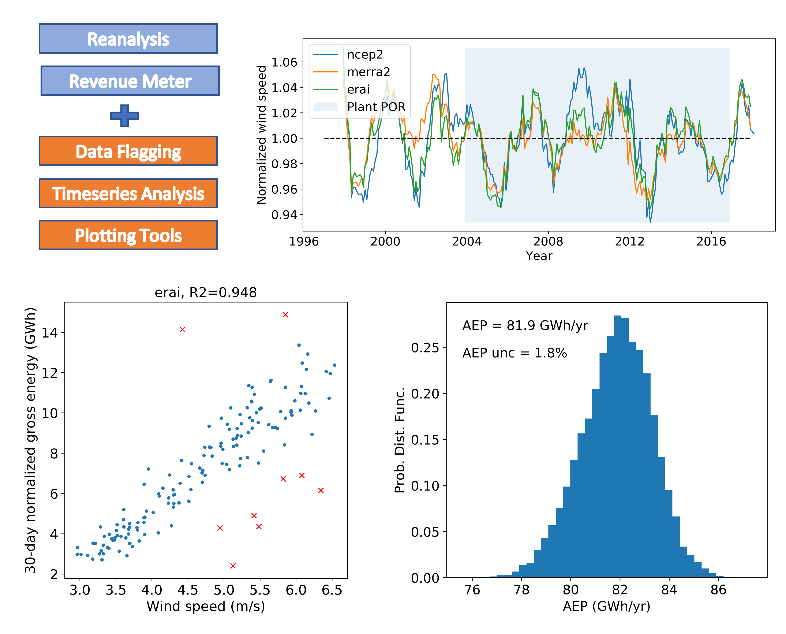
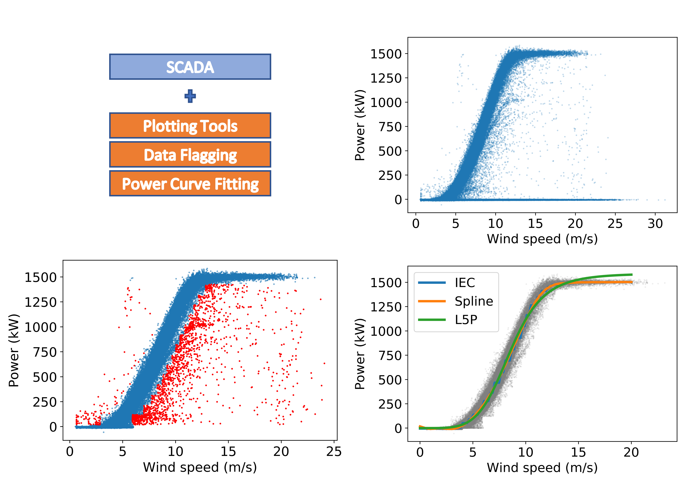

# Summary

OpenOA is an open source Python package which implements operational analysis (OA) methods for wind plants.
The development of OpenOA started internally at the National Renewable Energy Laboratory (NREL) to support the lab's efforts in the Wind Plant Performance and Prediction (WP3) Benchmark, which is a key risk reduction activity of the Performance, Risk, Uncertainty, and Finance project under the Atmosphere to Electrons initiative [@A2EWebsite].
The goal of WP3 is to provide an independent benchmark of bias in pre-construction energy yield assessment (EYA), and to understand the sources of uncertainty therein.
OpenOA was created to calculate the operational annual energy production (AEP) of case study wind power plants, providing a baseline to which bias can be measured. **[CITE WP3 RESULTS?]**
OpenOA has since expand its scope to support additional types of analyses including turbine performance and reliability and to support data from wind plants outside the initial set of test projects.
Released publicly in September 2018, the OpenOA repository contains numerous examples worked out in Jupyter notebooks, along with free example data which can be used to run the built in unit and integration tests.

## Published Work
OpenOA has been used in the following projects... **[CITATIONS]**

# Operational Analysis
Operational analyses consume data from various sources, including from supervisory control and data acquisition (SCADA) systems and reanalysis products (such as weather models).
These data are used to perform a wide variety of assessments ranging from the long-term estimates of annual energy production (AEP), diagnosis of faults and underperformance, benchmarking of performance improvements (e.g., wind sector management, vortex generators), and building/tuning statistical or physics-based models for various applications (e.g., wake model validation, wind power forecasting).

## Long Term AEP Calculation

The AEP analysis implemented in OpenOA is based on an industry-standard approach in which monthly gross energy for the wind plant (reported energy at the revenue meter corrected for availability and curtailment losses) is related to a monthly long-term wind resource through a linear regression relationship.
Calculation of AEP involves several steps:

- Processing of the revenue meter energy, loss estimates, and long-term reanalysis wind resource data.
- Review of different reanalysis data for suitability.
- Linear regression outlier detection and removal.
- Flagging and removal of high-energy loss months.
- Application of regression relationship of energy and wind resource to the long-term resource to calculate long-term gross energy.
- Estimation of long-term AEP from long-term gross energy and expected future losses.
- Uncertainty quantification through a Monte Carlo approach in which inputs to and intermediate calculations within the process are sampled based on their assumed or calculated uncertainties.

An example usage of this method is shown in Figure 1.
Here, revenue meter and reanalysis data attributes from Plant Data are used with several toolkit modules to calculate operational AEP for a wind plant.
The details of this particular example are provided in a Jupyter notebook on the GitHub repository.

*Figure 1: Using different OpenOA Toolkits to calculate wind plant AEP using operational data.
In this example, revenue meter and reanalysis data are processed using several toolkit modules.*

## Low Level Toolkits
There are currently seven low level modules in OpenOA called Toolkits, which are listed in Table \ref{tab:toolkits} along with a general description of their functions.
These modules range from general data processing (flagging, imputation, unit conversion, and time series modules) and those specifically intended for wind plant data processing (meteorological data processing, power curve fitting, and plotting).
The value of toolkit modules lies in their generality.
Each function was written to operate on array-like objects, such as Pandas Series, Data Frames, and NumPy Arrays.
In this way, the toolkit modules can be applied in a variety of situations, both internal and external to the OpenOA code base.

- Filters: Functions for flagging data based on a range of criteria.
- Imputing: Functions for filling in null data with interpolated (imputed) values.
- Meteorological data: Functions for calculating common meteorological variables used in wind resource analysis.
- Time series: Functions for common time series analysis, including missing time-stamp identification and gap filling.
- Unit conversion: Functions for common unit conversions in wind energy (e.g.,, power to energy).
- Power curve: Functions to fit data to a specified wind turbine power curve model (including parametric and nonparametric forms) and to then apply the power curve to wind speed data.
- Plotting tools: Functions to produce common wind resource and energy-related visualizations (e.g., the wind rose).

An example of toolkit use is shown in Figure 2.
Here, several power curve models are fit to filtered wind speed and power data for a specific turbine.
As shown in the figure, data from the Plant Data SCADA attribute and several toolkit modules are used to perform the flagging and removal of outlier data, the fitting of the power curve, and the plotting of results.
The steps of this particular example are provided in detail as a Jupyter notebook on the GitHub repository.

*Figure 2: Using different OpenOA modules to calculate idealized power curves for a sample wind turbine. In this example, SCADA data is filtered and then fit using three different power curve models.*

# Towards Industry Standards
OpenOA implements a data standard for wind plant supervisory control and data acquisition (SCADA) data, based on International Electrotechnical Commission (IEC) standard 61400-25.
The standard defines naming conventions for columns and data types for variables which are encountered in wind plants.
Unfortunately, this standard has seen only piecemeal adoption throughout the wind energy industry. **[CITE]**
OpenOA aims to boost this adoption by providing an internal data model based upon the 61400-25 standard.
Users are required to build a mapping of their data source to OpenOA's data model by extending the PlantData class.

Moving forward, we see a role for OpenOA in fostering standards development for the methods of operational analysis, in addition to the source data.
**ANY OTHER BENEFITS OF STANDARD OA?**
In providing a public repository for the collection and dissemination of OA methods and best practices, we believe significant efficiency gains can be achieved.

# Fostering Collaboration
The intent of OpenOA is to foster collaboration and methods sharing in a wind industry that has historically been very protective of methods and data.
Much of an OA analysis could be standard and uncontroversial, and by creating a public repository for the collection and dissemination of OA methods and best practices, significant efficiency gains can be achieved.
OpenOA currently implements a long-term corrected AEP analysis, and provides low level functions which are helpful in this computation.
Over time, we hope that OpenOA will become a reference implementation for OA methods from which a published standard (IEC or otherwise) may quickly follow.
To our knowledge, this approach of first fostering a collaborative repository of methods that are tested and used prior to developing a published standard is new to the wind industry, and may indeed prove more efficient than the multiyear approach of beginning immediately with a standard.

# Acknowledgements
This work was authored by the National Renewable Energy Laboratory, operated by Alliance for Sustainable Energy, LLC, for the U.S. Department of Energy (DOE) under Contract No. DE-AC36-08GO28308.
Funding provided by the U.S. Department of Energy Office of Energy Efficiency and Renewable Energy Wind Energy Technologies Office, within the Atmosphere to Electrons research program.
The views expressed in the article do not necessarily represent the views of the DOE or the U.S. Government.
The U.S. Government retains and the publisher, by accepting the article for publication, acknowledges that the U.S. Government retains a nonexclusive, paid-up, irrevocable, worldwide license to publish or reproduce the published form of this work, or allow others to do so, for U.S. Government purposes.

# References
