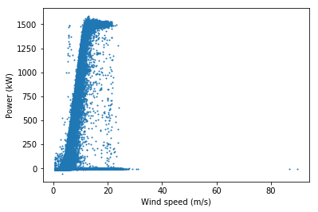
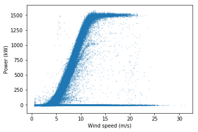
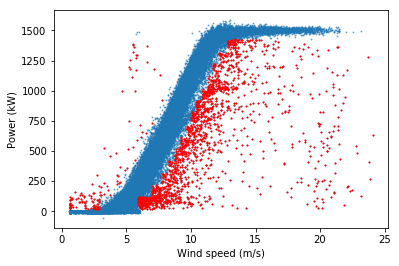
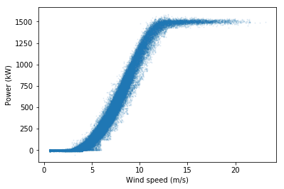
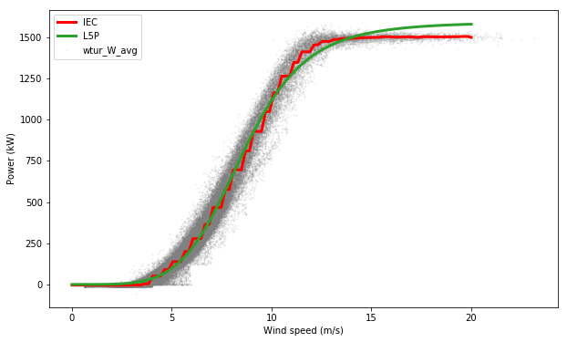

Import the Data
~~~~~~~~~~~~~~~

This notebook will explore the usage of different toolkit functions to
filter data and compute power curves from a single wind turbine. We
start the notebook by importing a project file (turbine_project.py, in
this case), instantiating a project, and calling its prepare method.
This process provides us with a PlantData object (turbine, in this case)
which can be used to query data.

.. code:: ipython2

    from turbine_project import TurbineExampleProject
    
    turbine = TurbineExampleProject()
    turbine.prepare()
    
    display(turbine.scada.head())

.. parsed-literal::

    INFO:root:Loading name:scada_10min_4cols

.. raw:: html

    

    
    <table border="1" class="dataframe">
      <thead>
        <tr style="text-align: right;">
          <th></th>
          <th>winddirection_deg</th>
          <th>windspeed_ms</th>
          <th>power_kw</th>
          <th>time</th>
        </tr>
        <tr>
          <th>time</th>
          <th></th>
          <th></th>
          <th></th>
          <th></th>
        </tr>
      </thead>
      <tbody>
        <tr>
          <th>2010-02-17 19:30:00</th>
          <td>0.0</td>
          <td>0.63</td>
          <td>-2.07</td>
          <td>2010-02-17 19:30:00</td>
        </tr>
        <tr>
          <th>2010-02-17 19:40:00</th>
          <td>0.0</td>
          <td>1.81</td>
          <td>-2.24</td>
          <td>2010-02-17 19:40:00</td>
        </tr>
        <tr>
          <th>2010-02-17 19:50:00</th>
          <td>0.0</td>
          <td>2.13</td>
          <td>-3.10</td>
          <td>2010-02-17 19:50:00</td>
        </tr>
        <tr>
          <th>2010-02-17 20:00:00</th>
          <td>0.0</td>
          <td>1.33</td>
          <td>-1.91</td>
          <td>2010-02-17 20:00:00</td>
        </tr>
        <tr>
          <th>2010-02-17 20:10:00</th>
          <td>0.0</td>
          <td>0.63</td>
          <td>-1.89</td>
          <td>2010-02-17 20:10:00</td>
        </tr>
      </tbody>
    </table>
    

PlantData objects contain references to several TimeseriesTable objects.
The only one which is useful for this demo is “scada.” The “df” member
of the scada TimeseriesTable exposes a Pandas dataframe which contains
cleaned SCADA data. Let’s use turbine.scada to define python variables
windspeed, power_kw, and df for convenience in later examples.

.. code:: ipython2

    windspeed = turbine.scada.df["windspeed_ms"]
    power_kw = turbine.scada.df["power_kw"]
    df = turbine.scada.df

Filter the Data
~~~~~~~~~~~~~~~

The filtering toolkit implements commonly used filters and operates by
returning a boolean series called “flag” which can be used to index the
original dataframe. We start by importing the filtering toolkit:

.. code:: ipython2

    from operational_analysis.toolkits import filters

First let’s define a plotting function for the turbine power curve which
we can use to examine the effect of different filtering functions on the
data

.. code:: ipython2

    import numpy as np
    import matplotlib.pyplot as plt

.. code:: ipython2

    def plot_flagged_pc(ws, p, flag_bool, alpha):
        plt.scatter(ws, p, s = 1, alpha = alpha)
        plt.scatter(ws[flag_bool], p[flag_bool], s = 1, c = 'red')
        plt.xlabel('Wind speed (m/s)')
        plt.ylabel('Power (kW)')
        plt.show()

Now first let’s take a look at the unprocessed data:

.. code:: ipython2

    plot_flagged_pc(windspeed, power_kw, np.repeat('True', df.shape[0]), 1)

Range Filter
~~~~~~~~~~~~

We immediately see two high wind speed outliers likely due to sensor
malfunction. We can flag and filter these outliers from the dataset
using the ‘range_flag’ function:

.. code:: ipython2

    # Show outliers
    out_of_range = filters.range_flag(windspeed, below=0, above=70)
    windspeed[out_of_range].head()

.. parsed-literal::

    time
    2017-02-03 20:00:00    89.79
    2017-02-03 20:10:00    86.67
    Name: windspeed_ms, dtype: float64

Let’s remove the outliers and plot the result:

.. code:: ipython2

    # Remove outliers
    windspeed = windspeed[~out_of_range]
    power_kw = power_kw[~out_of_range]

.. code:: ipython2

    # Show updated power curve
    plot_flagged_pc(windspeed, power_kw, np.repeat('True', df.shape[0]), 0.2)

Window Range Filter
~~~~~~~~~~~~~~~~~~~

We may want to remove turbine downtime events, which we can identify as
near zero power at high wind speeds. We can do this using the
‘window_range function’ and removing data greater than 6 m/s but with
power less than 20 kW:

.. code:: ipython2

    out_of_window = filters.window_range_flag(windspeed, 6., 40, power_kw, 20., 2000.)
    plot_flagged_pc(windspeed, power_kw, out_of_window, 0.2)

.. image:: Turbine_Toolkit_Examples_files/Turbine_Toolkit_Examples_17_0.png

Again, let’s remove these flagged data from consideration:

.. code:: ipython2

    windspeed = windspeed[~out_of_window]
    power_kw = power_kw[~out_of_window]

Bin Filter
~~~~~~~~~~

We may be interested in fitting a power curve to data representing
‘normal’ turbine operation. In other words, we want to flag all
anomalous data or data represenatative of underperformance. To do this,
the ‘bin_filter’ function is useful. It works by binning the data by a
specified variable, bin width, and start and end points. The criteria
for flagging is based on some measure (scalar or standard deviation)
from the mean or median of the bin center.

As an example, let’s bin on power in 100 kW increments, starting from
25.0 kW but stopping at 90% of peak power (i.e. we don’t want to flag
all the data at peak power and high wind speed. Let’s use a scalar
threshold of 1.5 m/s from the median for each bin. Let’s also consider
data on both sides of the curve by setting the ‘direction’ parameter to
‘all’

.. code:: ipython2

    max_bin = 0.90*power_kw.max()
    bin_outliers = filters.bin_filter(power_kw, windspeed, 100, 1.5, 'median', 20., max_bin, 'scalar', 'all')
    plot_flagged_pc(windspeed, power_kw, bin_outliers, 0.5)

As seen above, one call for the bin filter has done a decent job of
cleaning up the power curve to represent ‘normal’ operation, without
excessive removal of data points. There are a few points at peak power
but low wind speed that weren’t flagged, however. Let catch those, and
then remove those as well as the flagged data above, and plot our
‘clean’ power curve

.. code:: ipython2

    out_of_window = filters.window_range_flag(windspeed, 4., 8., power_kw, 0., 1250.)
    windspeed = windspeed[(~out_of_window) & (~bin_outliers)]
    power_kw = power_kw[(~out_of_window) & (~bin_outliers)]
    plot_flagged_pc(windspeed, power_kw, np.repeat('True', len(windspeed)), 0.1)

The bin filter gives a bit of a ‘choppy’ look to the power curve at
lower wind speeds, which we could clean up by using a smaller bin
filter.

Unresponsive Filter
~~~~~~~~~~~~~~~~~~~

As a final filtering demonstration, we can look for an unrespsonsive
sensor (i.e. repeating measurements). In this case, let’s look for 3 or
more repeating wind speed measurements:

.. code:: ipython2

    frozen = filters.unresponsive_flag(windspeed, 3)
    windspeed[frozen].head()

.. parsed-literal::

    time
    2010-02-18 02:10:00    0.63
    2010-02-18 02:20:00    0.63
    2010-02-18 02:30:00    0.63
    2010-02-18 02:40:00    0.63
    2010-02-18 02:50:00    0.63
    Name: windspeed_ms, dtype: float64

We actually found a lot, so let’s remove these data as well before
moving on to power curve fitting.

.. code:: ipython2

    windspeed = windspeed[~frozen]
    power_kw = power_kw[~frozen]

Fit the Power Curves
~~~~~~~~~~~~~~~~~~~~

Now that our data has been reasonably processed, we can fit a power
curve model to the data. Here we illustrate three types of power curves:
the standard IEC binned power curve model, a spline fit, and a Logistic
5 parameter model (L5P):

.. code:: ipython2

    from operational_analysis.toolkits import power_curve

.. code:: ipython2

    # Fit the power curves
    iec_curve = power_curve.IEC(windspeed, power_kw)
    l5p_curve = power_curve.logistic_5_parametric(windspeed, power_kw)
    spline_curve = power_curve.spline_fit(windspeed, power_kw, n_splines = 20)

.. code:: ipython2

    # Plot the results
    x = np.linspace(0,20,100)
    plt.figure(figsize = (10,6))
    plt.scatter(windspeed, power_kw, alpha=0.1, s = 1, c = 'gray')
    plt.plot(x, iec_curve(x), color="red", label = 'IEC', linewidth = 3)
    plt.plot(x, spline_curve(x), color="C1", label = 'Spline', linewidth = 3)
    plt.plot(x, l5p_curve(x), color="C2", label = 'L5P', linewidth = 3)
    plt.xlabel('Wind speed (m/s)')
    plt.ylabel('Power (kW)')
    plt.legend()
    plt.show()

The above plot shows that both the IEC and spline method accurately
capture the power curve (although the IEC method results in a ‘choppy’
fit), while the L5P model (constrained by its parametric form) deviates
from the knee of the power curve through peak production.

Relative Speed of Power Curve Fitting
~~~~~~~~~~~~~~~~~~~~~~~~~~~~~~~~~~~~~

We also note the speed of the computations. The IEC method is by far the
fastest, followed by the spline fit, and then the L5P model.

.. code:: ipython2

    import time

.. code:: ipython2

    start = time.time()
    power_curve.IEC(windspeed, power_kw)
    end = time.time()
    print 'IEC: ' + str(np.round(end - start, 3)) + ' seconds'

.. parsed-literal::

    IEC: 0.171 seconds

.. code:: ipython2

    start = time.time()
    power_curve.spline_fit(windspeed, power_kw, n_splines=20)
    end = time.time()
    print 'Spline: ' + str(np.round(end - start, 3)) + ' seconds'

.. parsed-literal::

    Spline: 21.586 seconds

.. code:: ipython2

    start = time.time()
    power_curve.logistic_5_parametric(windspeed, power_kw)
    end = time.time()
    print 'L5P: ' + str(np.round(end - start, 3)) + ' seconds'

.. parsed-literal::

    L5P: 38.665 seconds

