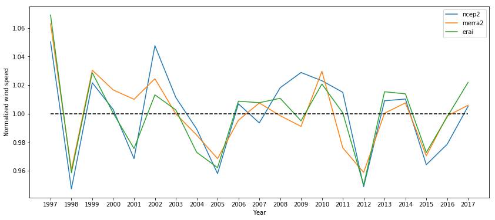
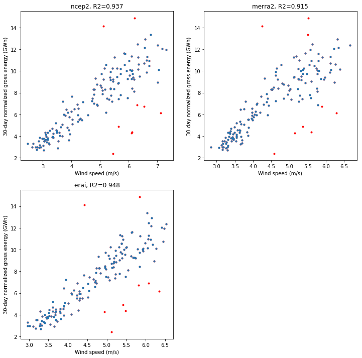
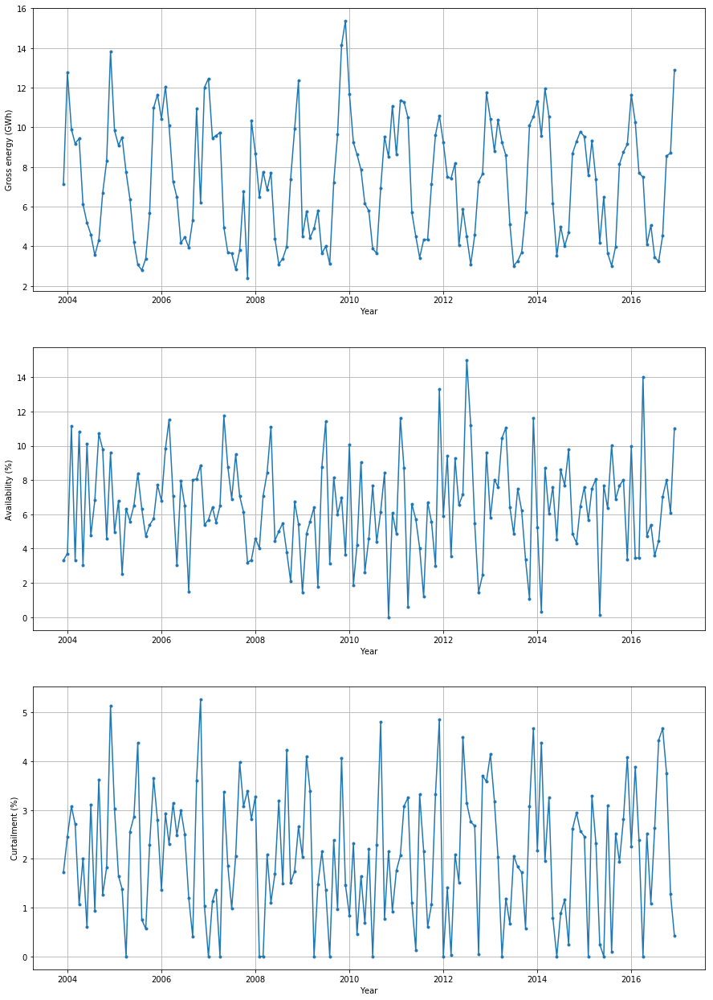
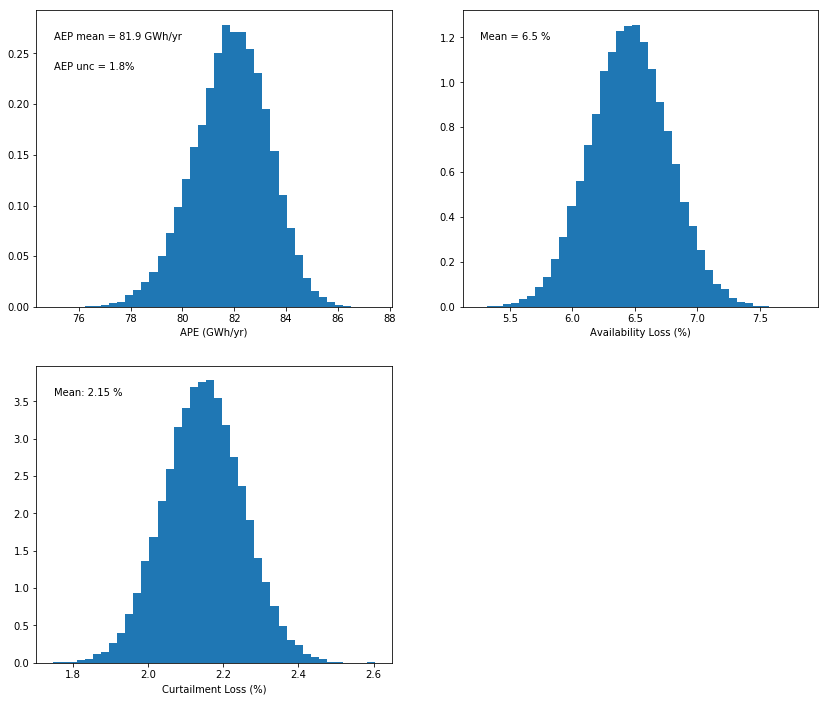
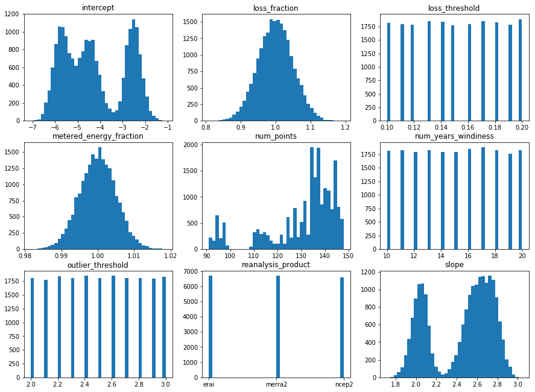
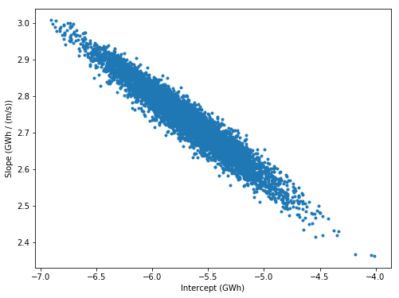
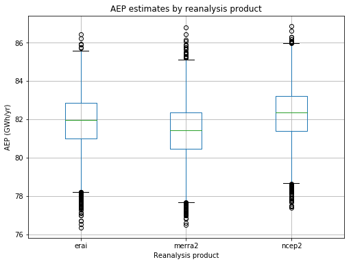
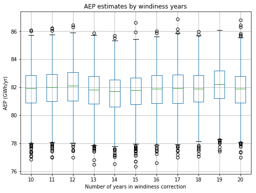

This notebook provides an overview and walk-through of the steps taken
to produce a plant-level operational energy asssessment (OA) of a wind
plant in the PRUF project. The wind plant analyzed here is a sample wind
plant taken from the EIA-923 database. Availability and curtailment data
are synthesized.

Uncertainty in the annual energy production (AEP) estimate is calculated
through a Monte Carlo approach. Specifically, inputs into the OA code as
well as intermediate calculations are randomly sampled based on their
specified or calculated uncertainties. By performing the OA assessment
thousands of times under different combinations of the random sampling,
a distribution of AEP values results from which uncertainty can be
deduced. Details on the Monte Carlo approach will be provided throughout
this notebook.

Step 1: Import plant data into notebook
~~~~~~~~~~~~~~~~~~~~~~~~~~~~~~~~~~~~~~~

A zip file included in the OpenOA
‘examples/operational_AEP_analysis/data’ folder needs to be unzipped
before running this step. Once unzipped, 4 CSV files will appear either
in the ‘examples/operational_AEP_analysis/data’ folder or in
‘examples/operational_AEP_analysis/data/example_eia_data’ depending on
how the zip file was unzipped.

.. code:: python

    # Import required packages
    import os
    import matplotlib.pyplot as plt
    import numpy as np
    import statsmodels.api as sm
    import pandas as pd
    import copy
    
    from project_EIA import Project_EIA
    from operational_analysis.methods import plant_analysis

.. parsed-literal::

    C:\Users\moptis\AppData\Local\Continuum\anaconda2\lib\site-packages\statsmodels\compat\pandas.py:56: FutureWarning: The pandas.core.datetools module is deprecated and will be removed in a future version. Please use the pandas.tseries module instead.
      from pandas.core import datetools
    WARNING:Fiona:PROJ data files not located, PROJ_LIB not set

In the call below, make sure the appropriate path to the CSV input files
is specfied. In this example, the CSV files are located directly in the
‘examples/operational_AEP_analysis/data’ folder.

.. code:: python

    # Load plant object
    project = Project_EIA('./data')

.. code:: python

    # Prepare data
    project.prepare()

.. parsed-literal::

    INFO:root:Loading name:plant_data
    INFO:root:Loading name:plant_data
    INFO:root:Loading name:merra2_data
    INFO:root:Loading name:ncep2_data
    INFO:root:Loading name:erai_data

Step 2: Review the data
~~~~~~~~~~~~~~~~~~~~~~~

Several Pandas data frames have now been loaded. You can view them
individually by removing the first ‘#’ or comment sign from one of the
lines below. As an example, the first few rows of the meter data is
shown below:

.. code:: python

    # Review plant data
    project._meter.df.head() # Metered energy data
    #project._curtail.df.head() # Curtailment and availability loss data
    #project._reanalysis._product['merra2'].head() # MERRA2 data
    #project._reanalysis._product['erai'].head() # ERA-I data
    #project._reanalysis._product['ncep2'].head() # ERA-I data

.. raw:: html

    

    
    <table border="1" class="dataframe">
      <thead>
        <tr style="text-align: right;">
          <th></th>
          <th>time</th>
          <th>energy_kwh</th>
        </tr>
        <tr>
          <th>time</th>
          <th></th>
          <th></th>
        </tr>
      </thead>
      <tbody>
        <tr>
          <th>2003-12-01</th>
          <td>2003-12-01</td>
          <td>6765000.0</td>
        </tr>
        <tr>
          <th>2004-01-01</th>
          <td>2004-01-01</td>
          <td>11996000.0</td>
        </tr>
        <tr>
          <th>2004-02-01</th>
          <td>2004-02-01</td>
          <td>8498000.0</td>
        </tr>
        <tr>
          <th>2004-03-01</th>
          <td>2004-03-01</td>
          <td>8628000.0</td>
        </tr>
        <tr>
          <th>2004-04-01</th>
          <td>2004-04-01</td>
          <td>8315000.0</td>
        </tr>
      </tbody>
    </table>
    

Step 3: Process the data into monthly averages and sums
~~~~~~~~~~~~~~~~~~~~~~~~~~~~~~~~~~~~~~~~~~~~~~~~~~~~~~~

The raw plant data can be in different time resolutions. The following
steps process the data into monthly averages and combine them into a
single ‘monthly’ data frame to be used in the OA assessment.

.. code:: python

    # Create plant analysis object
    pa = plant_analysis.PlantAnalysis(project)
    
    # Process Revenue Meter Energy and loss estimates, and reanalysis data
    pa.process_revenue_meter_energy() # Average to monthly, quantify NaN data
    pa.process_loss_estimates() # Average to monthly, quantify NaN data, merge with revenue meter energy data
    pa.process_reanalysis_data() # Density correct wind speeds, average to monthly
    pa.trim_monthly_df() # Remove first and last months if data was partial for those months
    
    # Drop any data that have NaN gross energy values (means either revenue meter, availability, or curtalment data was NaN)
    pa._monthly.df = pa._monthly.df.loc[np.isfinite(pa._monthly.df.gross_energy_gwh)]

Let’s view the result. Note the extra fields we’ve calculated that we’ll
use later for filtering: - energy_nan_perc : the percentage of NaN
values in the raw revenue meter data used in calculating the monthly
sum. If this value is too large, we shouldn’t include this month -
nan_flag : if too much energy, availability, or curtailment data was
missing for a given month, flag the result - num_days_expected : number
of days in the month (useful for normalizing monthly gross energy later)
- num_days_actual : actual number of days per month as found in the data
(used when trimming monthly data frame)

.. code:: python

    # View the monthly data frame
    pa._monthly.df.head()

.. raw:: html

    

    
    <table border="1" class="dataframe">
      <thead>
        <tr style="text-align: right;">
          <th></th>
          <th>energy_gwh</th>
          <th>energy_nan_perc</th>
          <th>num_days_expected</th>
          <th>num_days_actual</th>
          <th>availability_gwh</th>
          <th>curtailment_gwh</th>
          <th>gross_energy_gwh</th>
          <th>availability_pct</th>
          <th>curtailment_pct</th>
          <th>avail_nan_perc</th>
          <th>curt_nan_perc</th>
          <th>nan_flag</th>
          <th>availability_typical</th>
          <th>curtailment_typical</th>
          <th>combined_loss_valid</th>
          <th>ncep2</th>
          <th>merra2</th>
          <th>erai</th>
        </tr>
        <tr>
          <th>time</th>
          <th></th>
          <th></th>
          <th></th>
          <th></th>
          <th></th>
          <th></th>
          <th></th>
          <th></th>
          <th></th>
          <th></th>
          <th></th>
          <th></th>
          <th></th>
          <th></th>
          <th></th>
          <th></th>
          <th></th>
          <th></th>
        </tr>
      </thead>
      <tbody>
        <tr>
          <th>2003-12-01</th>
          <td>6.765</td>
          <td>0.0</td>
          <td>31</td>
          <td>31</td>
          <td>0.236601</td>
          <td>0.122979</td>
          <td>7.124581</td>
          <td>0.033209</td>
          <td>0.017261</td>
          <td>0.0</td>
          <td>0.0</td>
          <td>False</td>
          <td>True</td>
          <td>True</td>
          <td>True</td>
          <td>6.287746</td>
          <td>5.782525</td>
          <td>6.081313</td>
        </tr>
        <tr>
          <th>2004-01-01</th>
          <td>11.996</td>
          <td>0.0</td>
          <td>31</td>
          <td>31</td>
          <td>0.474774</td>
          <td>0.313968</td>
          <td>12.784742</td>
          <td>0.037136</td>
          <td>0.024558</td>
          <td>0.0</td>
          <td>0.0</td>
          <td>False</td>
          <td>True</td>
          <td>True</td>
          <td>True</td>
          <td>7.010919</td>
          <td>6.657693</td>
          <td>6.536138</td>
        </tr>
        <tr>
          <th>2004-02-01</th>
          <td>8.498</td>
          <td>0.0</td>
          <td>29</td>
          <td>29</td>
          <td>1.102582</td>
          <td>0.305067</td>
          <td>9.905649</td>
          <td>0.111308</td>
          <td>0.030797</td>
          <td>0.0</td>
          <td>0.0</td>
          <td>False</td>
          <td>True</td>
          <td>True</td>
          <td>True</td>
          <td>5.153451</td>
          <td>5.388867</td>
          <td>5.094191</td>
        </tr>
        <tr>
          <th>2004-03-01</th>
          <td>8.628</td>
          <td>0.0</td>
          <td>31</td>
          <td>31</td>
          <td>0.305451</td>
          <td>0.249042</td>
          <td>9.182493</td>
          <td>0.033265</td>
          <td>0.027121</td>
          <td>0.0</td>
          <td>0.0</td>
          <td>False</td>
          <td>True</td>
          <td>True</td>
          <td>True</td>
          <td>5.652450</td>
          <td>5.440886</td>
          <td>5.183419</td>
        </tr>
        <tr>
          <th>2004-04-01</th>
          <td>8.315</td>
          <td>0.0</td>
          <td>30</td>
          <td>30</td>
          <td>1.020940</td>
          <td>0.100038</td>
          <td>9.435977</td>
          <td>0.108196</td>
          <td>0.010602</td>
          <td>0.0</td>
          <td>0.0</td>
          <td>False</td>
          <td>True</td>
          <td>True</td>
          <td>True</td>
          <td>5.345851</td>
          <td>5.121183</td>
          <td>5.044114</td>
        </tr>
      </tbody>
    </table>
    

Step 4: Review reanalysis data
~~~~~~~~~~~~~~~~~~~~~~~~~~~~~~

Reanalysis data will be used to long-term correct the operational energy
over the plant period of operation to the long-term. It is important
that we only use reanalysis data that show reasonable trends over time
with no noticeable discontinuities. A plot like below, in which
normalized annual wind speeds are shown from 1997 to present, provides a
good first look at data quality.

The plot shows that 3 of the reanalysis products track each other
reasonably well and seem well-suited for the analysis.

.. code:: python

    # Make a plot of annual average wind speeds from reanalysis data to show general trends for each
    # Remove data with incomplete years
    
    plt.figure(figsize=(14,6))
    for key,items in project._reanalysis._product.iteritems():
        rean_df=project._reanalysis._product[key].df
        ann_ws=rean_df.groupby(rean_df.index.year)['ws_dens_corr'].mean().to_frame()
        ann_ws['num_ent']=rean_df.groupby(rean_df.index.year)['ws_dens_corr'].count()
        ann_ws_valid=ann_ws.loc[np.abs(ann_ws.num_ent/ann_ws.num_ent.mean())>0.9]
        plt.plot(ann_ws_valid['ws_dens_corr']/ann_ws_valid['ws_dens_corr'].mean(),label=key)
    plt.plot((1997,2017),(1,1),'k--')
    plt.xticks(np.arange(1997,2018))
    plt.xlabel('Year')
    plt.ylabel('Normalized wind speed')
    plt.legend()
    plt.show()
    

Step 5: Review energy data
~~~~~~~~~~~~~~~~~~~~~~~~~~

It is useful to take a look at the energy data and make sure the values
make sense. We begin with scatter plots of gross energy and wind speed
for each reanalysis product. We also show a time series of gross energy,
as well as availability and curtailment loss.

Let’s start with the scatter plots of gross energy vs wind speed for
each reanalysis product. Here we use the ‘Robust Linear Model’ (RLM)
module of the Statsmodels package with the default Huber algorithm to
produce a regression fit that excludes outliers. Data points in red show
the outliers, and were excluded based on a Huber sensitivity factor of
3.0 (the factor is varied between 2.0 and 3.0 in the Monte Carlo
simulation).

The plots below reveal that: - there are a large number of outliers
(typical of EIA data) - All renalysis products are strongly correlated
with plant energy

.. code:: python

    ## Make a plot of normalized 30-day gross energy vs wind speed for each reanalysis product, include R2 measure
    valid_monthly=pa._monthly.df
    plt.figure(figsize=(12,12))
    ws_temp=np.arange(10)
    for p in np.arange(0,len(project._reanalysis._product.keys())):
        col_name=project._reanalysis._product.keys()[p]
        
        x = sm.add_constant(valid_monthly[col_name]) # Exclude partial month at end
        y = valid_monthly['gross_energy_gwh']*30/valid_monthly['num_days_expected'] # Exclude partial month at end
            
        rlm = sm.RLM(y, x, M = sm.robust.norms.HuberT(t=3))
        rlm_results = rlm.fit()
        
        r2 = np.corrcoef(x.loc[rlm_results.weights==1, col_name],y[rlm_results.weights==1])[0,1]
      
        plt.subplot(2,2,p+1)
        plt.plot(x[col_name],y,'r.')
        plt.plot(x.loc[rlm_results.weights==1, col_name],y[rlm_results.weights==1],'.')
        plt.title(col_name+', R2='+str(np.round(r2,3)))
        plt.xlabel('Wind speed (m/s)')
        plt.ylabel('30-day normalized gross energy (GWh)')
    plt.show() 

Next we show time series plots of the monthly gross energy, availabilty,
and curtialment. Note the randomness of the availability and curtailment
data, which were in fact randomly generated.

.. code:: python

    plt.figure(figsize=(15,22))
    
    plt.subplot(3,1,1)
    plt.plot(valid_monthly.gross_energy_gwh,'.-')
    plt.grid('on')
    plt.xlabel('Year')
    plt.ylabel('Gross energy (GWh)')
    
    plt.subplot(3,1,2)
    plt.plot(valid_monthly.availability_pct*100,'.-')
    plt.grid('on')
    plt.xlabel('Year')
    plt.ylabel('Availability (%)')
    
    plt.subplot(3,1,3)
    plt.plot(valid_monthly.curtailment_pct*100,'.-')
    plt.grid('on')
    plt.xlabel('Year')
    plt.ylabel('Curtailment (%)')
    
    plt.show()

Step 6: Specify availabilty and curtailment data not represenative of actual plant performance
~~~~~~~~~~~~~~~~~~~~~~~~~~~~~~~~~~~~~~~~~~~~~~~~~~~~~~~~~~~~~~~~~~~~~~~~~~~~~~~~~~~~~~~~~~~~~~

There may be anomalies in the reported availabilty that shouldn’t be
considered representative of actual plant performance. Force majeure
events (e.g. lightning) are a good example. Such losses aren’t typically
considered in pre-construction AEP estimates; therefore, plant
availablity loss reported in an operational AEP analysis should also not
include such losses.

The ‘availability_typical’ and ‘curtailment_typical’ fields in the
monthly data frame are initially set to True. Below, individual months
can be set to ‘False’ if it is deemed those months are unrepresentative
of long-term plant losses. By flagging these months as false, they will
be omitted when assessing average availabilty and curtailment loss for
the plant.

Justification for removing months from assessing average availabilty or
curtailment should come from conversations with the owner/operator. For
example, if a high-loss month is found, reasons for the high loss should
be discussed with the owner/operator to determine if those losses can be
considered representative of average plant operation.

.. code:: python

    # For illustrative purposes, let's suppose a few months aren't representative of long-term losses
    pa._monthly.df.loc['2016-11-01',['availability_typical','curtailment_typical']] = False
    pa._monthly.df.loc['2013-07-01',['availability_typical','curtailment_typical']] = False

Step 7: Calculate long-term annual losses
~~~~~~~~~~~~~~~~~~~~~~~~~~~~~~~~~~~~~~~~~

Once unrepresentative losses have been identifed, long-term availability
and curtailment losses for the plant are calculated based on average
losses for each calendar month (in energy units). Summing those average
values yields the long-term annual estimates.

.. code:: python

    pa.calculate_long_term_losses()

Step 8: Select reanalysis products to use
~~~~~~~~~~~~~~~~~~~~~~~~~~~~~~~~~~~~~~~~~

Based on the assessment of reanalysis products above (both long-tern
trend and relationship with plant energy), we now set which reanalysis
products we will include in the OA. For this particular case study, we
use all 3 products given the high regression relationships.

.. code:: python

    # Based on the above considerations, determine which reanalysis products should be used in assesing operational AEP
    valid_reanalysis={'ncep2':True,'erai':True,'merra2':True}
    reanal_subset=[key for key,value in valid_reanalysis.iteritems() if value == True]
    reanal_subset

.. parsed-literal::

    ['ncep2', 'merra2', 'erai']

Step 9: Set up Monte Carlo inputs
~~~~~~~~~~~~~~~~~~~~~~~~~~~~~~~~~

The next step is to set up the Monte Carlo framework for the analysis.
Specifically, we identify each source of uncertainty in the OA estimate
and use that uncertainty to create distributions of the input and
intermediate variables from which we can sample for each iteration of
the OA code. For input variables, we can create such distributions
beforehand. For intermediate variables, we must sample separately for
each iteration.

Running the code in the next cell produces a Monte-Carlo tracker data
frame which shows the sampled inputs for each iteration of the OA code.
More detailed descriptions are provided below:

-  slope, intercept, and num_outliers : These are just placeholder empty
   values for now, since these are intermediate variables that are
   calculated for each iteration of the code

-  outlier_threshold : Sample values between 2 and 3 which set the Huber
   algorithm outlier detection parameter. Varying this threshold
   accounts for analyst subjectivity on what data points constitute
   outliers and which do not.

-  metered_energy_fraction : Revenue meter energy measurements are
   associated with a measurement uncertainty of around 0.5%. This
   uncertainty is used to create a distribution centered at 1 (and with
   standard deviation therefore of 0.005). This column represents random
   samples from that distribution. For each iteration of the OA code, a
   value from this column is multiplied by the monthly revenue meter
   energy data before the data enter the OA code, thereby capturing the
   0.5% uncertainty.

-  loss_fraction : Reported availability and curtailment losses are
   estimates and are associated with uncertainty. For now, we assume the
   reported values are associated with an uncertainty of 5%. Similar to
   above, we therefore create a distribution centered at 1 (with std of
   0.05) from which we sample for each iteration of the OA code. These
   sampled values are then multiplied by the availability and curtaiment
   data independently before entering the OA code to capture the 5%
   uncertainty in the reported values.

-  num_years_windiness : This intends to capture the uncertainty
   associated with the number of historical years an analyst chooses to
   use in the windiness correction. The industry standard is typically
   20 years and is based on the assumption that year-to-year wind speeds
   are uncorrelated. However, a growing body of research suggests that
   there is some correlation in year-to-year wind speeds and that there
   are trends in the resource on the decadal timescale. To capture this
   uncertainty both in the long-term trend of the resource and the
   analyst choice, we randomly sample integer values betweeen 10 and 20
   as the number of years to use in the windiness correction.

-  loss_threshold : Due to uncertainty in reported availability and
   curtailment estimates, months with high combined losses are
   associated with high uncertainty in the calculated gross energy. It
   is common to remove such data from analysis. For this analysis, we
   randomly sample float values between 0.1 and 0.2 (i.e. 10% and 20%)
   to serve as criteria for the combined availability and curtailment
   losses. Specifically, months are excluded from analysis if their
   combined losses exceeds that criteria for the given OA iteration.

-  reanalyis_product : This captures the uncertainty of using different
   reanalysis products and, lacking a better method, is a proxy way of
   capturing uncertainty in the modelled monthly wind speeds. For each
   iteration of the OA code, one of the reanalysis products that we’ve
   already determined as valid (see the cells above) is selected.

.. code:: python

    # Get distribution of AEP values by running the OA multiple times under a Monte Carlo approach
    num_sim = 20000 # Number of simulations
    pa.setup_monte_carlo_inputs(reanal_subset, num_sim)

Step 10: Run the OA code
~~~~~~~~~~~~~~~~~~~~~~~~

We’re now ready to run the Monte-Carlo based OA code. We repeat the OA
process “num_sim” times using different sampling combinations of the
input and intermediate variables to produce a distribution of AEP
values.

A single line of code here in the notebook performs this step, but below
is more detail on what is being done.

Steps in OA process: - Set the wind speed and gross energy data to be
used in the regression based on i) the reanalysis product to be used
(Monte-Carlo sampled); ii) the NaN energy data criteria (1%); iii)
Combined availability and curtailment loss criteria (Monte-Carlo
sampled); and iv) the outlier criteria (Monte-Carlo sampled) - Normalize
gross energy to 30-day months - Perform linear regression and determine
slope and intercept values, their standard errors, and the covariance
between the two - Use the information above to create distributions of
possible slope and intercept values (e.g. mean equal to slope, std equal
to the standard error) from which we randomly sample a slope and
intercept value (note that slope and intercept values are highly
negatively-correlated so the sampling from both distributions are
constrained accordingly) - to perform the long term correction, first
determine the long-term monthly average wind speeds (i.e. average
January wind speed, average Februrary wind speed, etc.) based on a 10-20
year historical period as determined by the Monte Carlo process. - Apply
the Monte-Carlo sampled slope and intercept values to the long-term
monthly average wind speeds to calculate long-term monthly gross energy
- ‘Denormalize’ monthly long-term gross energy back to the normal number
of days - Calculate AEP by subtracting out the long-term avaiability
loss (curtailment loss is left in as part of AEP)

.. code:: python

    # Run Monte-Carlo based OA
    sim_results=pa.run_AEP_monte_carlo(num_sim)

.. parsed-literal::

    100%|███████████████████████████████████████████████████████████████████████████| 20000/20000 [01:09<00:00, 286.39it/s]

The key result is shown below: a distribution of AEP values from which
uncertainty can be deduced. In this case, uncertainty is low at 1.8%.
Note that this is considerably lower than a typical industry OA estimate
(~4-7%). The reason for this is that we’re not including interannual
variability (IAV) uncertainty, which typically dominates the uncertainty
in an industry OA. The reason for not including IAV uncertainty is that
it is fundamentally a future or forward-looking uncertainty (i.e. what
will annual energy production look like next year, or the next 10 years,
based on what we’ve seen so far). In this context, IAV uncertainty is
vital. For PRUF, we are not making a future estimate of energy
production but simply long-term correcting the observed energy
production to date. For this reason, we don’t need to consider IAV
uncertainty; rather, the uncertainty value we produce is our confidence
in the long-term corrected historical AEP assessment we’re providing.

Of course, historical IAV in the wind resource is captured in this
uncertainty value, namely through capturing the uncertainty in the slope
and intercept values and the number of years in the windiness
correction.

.. code:: python

    # Plot a distribution of APE values from the Monte-Carlo OA method
    
    fig=plt.figure(figsize=(14,12))
    
    ax = fig.add_subplot(2,2,1)
    ax.hist(sim_results['aep_GWh'],40,normed=1)
    ax.text(0.05,0.9,'AEP mean = '+str(np.round(sim_results['aep_GWh'].mean(),1))+ ' GWh/yr',transform=ax.transAxes)
    ax.text(0.05,0.8,'AEP unc = '+str(np.round(sim_results['aep_GWh'].std()/sim_results['aep_GWh'].mean()*100,1))+"%",transform=ax.transAxes)
    plt.xlabel('APE (GWh/yr)')
    
    ax = fig.add_subplot(2,2,2)
    ax.hist(sim_results['avail_pct']*100,40,normed=1)
    ax.text(0.05,0.9,'Mean = '+str(np.round((sim_results['avail_pct'].mean())*100,1))+ ' %',transform=ax.transAxes)
    plt.xlabel('Availability Loss (%)')
    
    ax = fig.add_subplot(2,2,3)
    ax.hist(sim_results['curt_pct']*100,40,normed=1)
    ax.text(0.05,0.9,'Mean: '+str(np.round((sim_results['curt_pct'].mean())*100,2))+ ' %',transform=ax.transAxes)
    plt.xlabel('Curtailment Loss (%)')
    
    plt.show()

Step 11: Post-analysis visualization
~~~~~~~~~~~~~~~~~~~~~~~~~~~~~~~~~~~~

Here we show some supplementary results of the Monte Carlo OA approach
to help illustrate how it works.

First, it’s worth looking at the Monte-Carlo tracker data frame again,
now that the slope, intercept, and number of outlier fields have been
completed. Note that for transparency, debugging, and analysis purposes,
we’ve also included in the tracker data frame the number of data points
used in the regression.

.. code:: python

    # Produce histograms of the various MC-parameters
    mc_reg = pd.DataFrame(data = {'slope': pa._mc_slope,
                                 'intercept': pa._mc_intercept, 
                                  'num_points': pa._mc_num_points, 
                                  'outlier_threshold': pa._mc_outlier_threshold, 
                                  'metered_energy_fraction': pa._mc_metered_energy_fraction, 
                                  'loss_fraction': pa._mc_loss_fraction, 
                                  'num_years_windiness': pa._mc_num_years_windiness, 
                                  'loss_threshold': pa._mc_loss_threshold, 
                                  'reanalysis_product': pa._mc_reanalysis_product})

It’s useful to plot distributions of each variable to show what is
happening in the Monte Carlo OA method. Based on the plot below, we
observe the following:

-  metered_energy_fraction, and loss_fraction sampling follow a normal
   distribution as expected
-  There are multiple slope and intercept distributions due to the
   different reanalysis products and the different regression
   relationships. Had one reanalysis product been used, we would see a
   single distribution
-  A maximum number of almost 150 data points were used, and a minimum
   of just over 90 were used. So significant outlier removal occurred.
-  We see approximately equal sampling of the outlier_threshold,
   num_years_windiness, loss_threshold, and reanalysis_product, as
   expected

.. code:: python

    plt.figure(figsize=(15,15))
    for s in np.arange(mc_reg.shape[1]):
        plt.subplot(4,3,s+1)
        plt.hist(mc_reg.iloc[:,s],40)
        plt.title(mc_reg.columns[s])
    plt.show()

It’s worth highlighting the inverse relationship between slope and
intercept values under the Monte Carlo approach. As stated earlier,
slope and intercept values are strongly negatively correlated
(e.g. slope goes up, intercept goes down) which is captured by the
covariance result when performing linear regression. By constrained
random sampling of slope and intercept values based on this covariance,
we assure we aren’t sampling unrealisic combinations.

The plot below shows that the values are being sampled appropriately

.. code:: python

    # Produce scatter plots of slope and intercept values, and overlay the resulting line of best fits over the actual wind speed 
    # and gross energy data points. Here we focus on the ERA-I data
    
    plt.figure(figsize=(8,6))
    plt.plot(mc_reg.intercept[mc_reg.reanalysis_product =='erai'],mc_reg.slope[mc_reg.reanalysis_product =='erai'],'.')
    plt.xlabel('Intercept (GWh)')
    plt.ylabel('Slope (GWh / (m/s))')
    plt.show()

We can look further at the influence of certain Monte Carlo parameters
on the AEP result. For example, let’s see what effect the choice of
reanalysis product has on the result:

.. code:: python

    # Boxplot of AEP based on choice of reanalysis product
    
    tmp_df=pd.DataFrame(data={'aep':sim_results.aep_GWh,'reanalysis_product':mc_reg['reanalysis_product']})
    tmp_df.boxplot(column='aep',by='reanalysis_product',figsize=(8,6))
    plt.ylabel('AEP (GWh/yr)')
    plt.xlabel('Reanalysis product')
    plt.title('AEP estimates by reanalysis product')
    plt.suptitle("")
    plt.show()

The use of MERRA2 leads to a lower AEP estimate, whereas NCEP2 gives a
slightly higher estimate.

We can also look at the effect on the number of years used in the
windiness correction:

.. code:: python

    # Boxplot of AEP based on number of years in windiness correction
    
    tmp_df=pd.DataFrame(data={'aep':sim_results.aep_GWh,'num_years_windiness':mc_reg['num_years_windiness']})
    tmp_df.boxplot(column='aep',by='num_years_windiness',figsize=(8,6))
    plt.ylabel('AEP (GWh/yr)')
    plt.xlabel('Number of years in windiness correction')
    plt.title('AEP estimates by windiness years')
    plt.suptitle("")
    plt.show()

As seen above, the number of years used in the windiness correction does
not significantly impact the AEP estimate.
